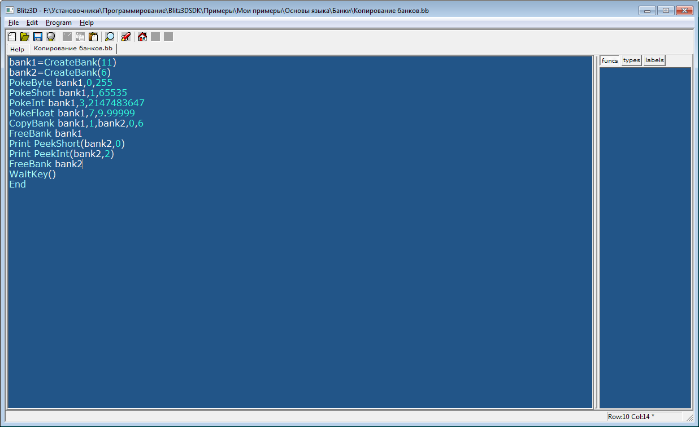

# Интерфейс программы

Так выглядит окно Blitz3d:

Синее текстовое поле является основным – в нём пишут программный код.

Кнопки панели инструментов:
*  - `(New)` – создание нового проекта
*  - `(Open)` – открытие существующего проекта
*  - `(Save)` – сохранение проекта
*  - `(Close)` – закрытие текущего проекта
*  - `(Cut)` – вырезать в буфер обмена
*  - `(Copy)` – копировать в буфер обмена
*  - `(Paste)` - вставить
*  - `(Find)` – найти текст
*  - `(Run)` – запуск проекта
*  - `(Home)` – перейти на страницу помощи
*  - `(Back)` – вернуться на предыдущую страницу в окне помощи
*  - `(Forward)` – вернуться на следующую страницу в окне помощи

Для закрытия\открытия панели инструментов: меню `Edit` -> `ShowToolbars` или **Shift + Esc**

Запуск и отладка программы:
* Для запуска программы нажмите **F5** или 
* Для запуска предыдущей программы нажмите F6**
* Для проверки ошибок нажмите **F7**
* Для создания .exe файла нажмите: меню `Program` -> `Create Executable`
* Для включения\отключения отладочного окна: меню `Program` -> `Debug Enabled`.
  В правой части окна находится панель с тремя вкладками:
  + `Funcs` – отображает все функции, которые используются в проекте.
  + `Types` – отображает все типы, которые используются в проекте.
  + `Label` – отображает все метки.
            
Во время написания программы для краткого описания команды, возле которой находится текстовый курсор, нажмите **F1**.
Так выглядит окно отладочного окна:

В нем отображается код программы и выделенное место выполнения текущей команды.

Кнопки на панели инструментов окна отладки:
*  - остановка программы (пауза)
*  - возобновление программы
*  - без входа в функцию
*  - вход в функцию
*  - выход из функции
*  - остановить выполнение

В правой части окна отладочного модуля находится панель с тремя вкладками:
* `Locals` – отображает все локальные переменные и их значения
* `Globals` – отображает все глобальные переменные и их значения
* `Consts` - отображает константы их значения
